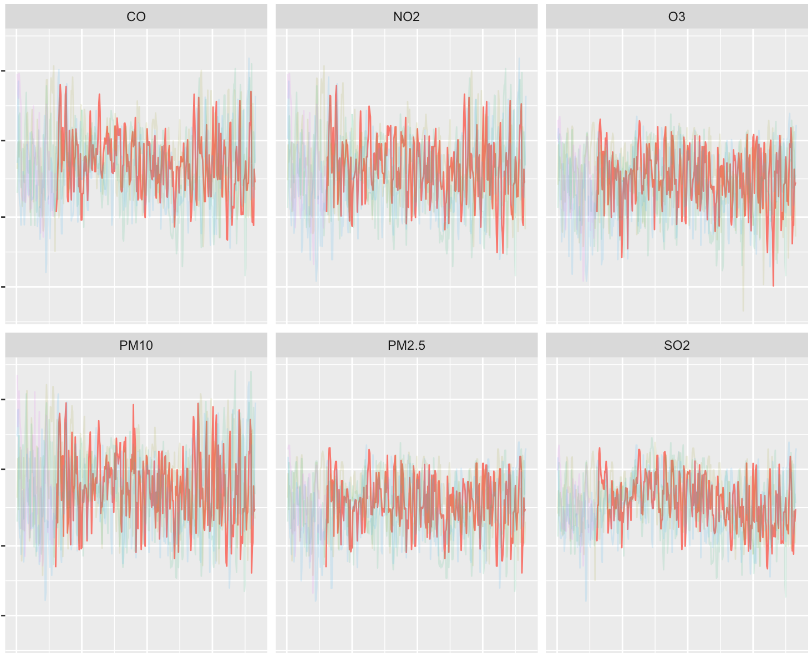

# Spatiotemporal Data

## Background. 
Industrialization and manufacturing growth in China has been accompanied by
major growth in pollution. Key pollutants include fine particulate matter (PM2.5 and PM10),
nitrogen dioxide (NO2), sulfur dioxide (SO2), surface ozone (O3), and carbon monoxide (CO).
The US EPA's Air Quality Index (AQI) is one index of air quality based on these six pollutants. To
attain a “good” AQI based on PM2.5, the 24-hour average has to be less than 12 μg/m^3; a 24-hour
average PM2.5-level of at least 55.5 μg/m^3 is considered “unhealthy,” while levels above 250.5
μg/m3 are considered "hazardous." The data here come from Beijing, notable for poor air quality.

## Data
The file `beijing.csv` contains 420,768 hourly measurements of PM2.5 and weather-related
factors measured at 12 monitoring stations around Beijing from March 1, 2013 through February
28, 2017. These files have not been cleaned. The data are as follows, with all pollutants measured
in micrograms per cubic meter (μg/m^3).

* year: year of measurement
* month: month of measurement
* day: day of measurement
* hour: hour of measurement
* PM2.5: PM2.5 concentration
* PM10: PM10 concentration
* SO2: sulfur dioxide concentration
* NO2: nitrogen dioxide concentration
* O3: surface ozone concentration
* CO: carbon monoxide concentration
* TEMP: temperature in degrees Celsius
* PRES: barometric pressure in hectopascals
* RAIN: precipitation in millimeters
* wd: wind direction; 16 compass directions (N, NNE, NE, ENE, E, etc.)
* WSPM: wind speed in meters per second
* station: monitoring site (twelve unique sites spaced around the city)

## 1. Data Cleaning

```{r setup, include=FALSE}
knitr::opts_chunk$set(echo = TRUE)
```

**a.** We have data at an hourly scale, but there are a couple derived attributes related to date that we may find useful:
* Add a column for "day of year" (for example, January 3rd is the third day of the year) using the `yday` function in the `lubridate` package.
* Add a column for "weekday" using your method of choice. Hint: `format( , "%A")` may be useful.
* Use `as.Date(ISOdate())` to build a new column called `as_date`.

```{r date-cleaning}
library(tidyverse)
library(lubridate)

beijing <- read.csv("beijing.csv")
beijing$as_date = as.Date(ISOdate(beijing$year, beijing$month, beijing$day))

beijing$weekday <- format(beijing$as_date, "%A")
beijing$day_of_year <- yday(beijing$as_date)
```

**b.** Each measurement is associated with a weather station. The location of each station in is `stations.csv`. Inner join the information from that file
into our air quality data.

```{r join-stations}
stations <- read.csv("stations.csv")
beijing <- inner_join(beijing, stations, by=c("station"))
```

**c.** This data is currently in a wide format with respect to the pollutants (one column for each pollutant), but we would like to compare trends across
pollutants. Ideally we would have figures that summarizes ALL our data, while splitting up by pollutant. This calls for a long format.
Use the `pivot_longer` function from the `tidyverse` to make a new data frame with a row for each pollutant, and a column titled `pollutant` for
the name of the pollutant and `concentration` for the concentration of it.


```{r pivoting}
beijing_long <- pivot_longer(beijing, c("PM2.5", "PM10", "SO2", "NO2", "CO", "O3"), names_to="pollutant", values_to="concentration")
```


## 2. Temporal patterns

**a.** Build a single figure that describes the distribution of the pollutants depending on the day of the week. To make your figure more informative,
consider the order that the weekdays are displayed. For this first figure, do not use `facet_wrap` or `facet_grid` and instead set the `x` aesthetic
to `pollutant`.

```{r day-of-the-week}
beijing_long$weekday <- factor(beijing_long$weekday, levels=c("Monday", "Tuesday", "Wednesday", "Thursday", "Friday", "Saturday", "Sunday"))
ggplot(beijing_long, aes(pollutant, concentration, fill=weekday)) +
    geom_boxplot() +
    ylab("Concentration")
```

**b.** Wow that figure looks pretty rough since the pollutants concentrations vary not only across pollutants, but also within due to the huge amount of
outliers! Make the same figure but use a log scale. What base of the logarithm should you use?

```{r day-of-the-week-log}
ggplot(beijing_long, aes(pollutant, concentration, fill=weekday)) +
    geom_boxplot() +
    scale_y_continuous(trans='log10') +
    ylab("Concentration")
```

**c.** Now make the same graph but use `facet_wrap` or `facet_grid`. Is this figure, or the one above more informative (your opinion)?

```{r day-of-the-week-log-facet}
ggplot(beijing_long, aes(y = concentration, fill=weekday)) +
    geom_boxplot() +
    scale_y_continuous(trans='log10') +
    ylab("Concentration") + 
    facet_wrap(~pollutant)
```


**d.** The distributions look much easier to visualize now while not comprimising the conclusions we can draw. Does the day of the week seem to make a 
difference?


**e.** Make a similar figure with a log scale, but showing the change in pollutants by month. It is your choice if you would like to facet or not.
Describe some patterns you see in the data.

```{r by-month-log}
ggplot(beijing_long, aes(pollutant, concentration, fill=factor(month))) +
    geom_boxplot() +
    scale_y_continuous(trans='log10') +
    ylab("Concentration") +
    scale_fill_discrete(labels=month.abb)
```

**f.** Finally make a similar figure, but on an hourly scale. How could this plot be improved?

```{r by-hour-log}
ggplot(beijing_long, aes(pollutant, concentration, fill=factor(hour))) +
    geom_boxplot() +
    scale_y_continuous(trans='log10') +
    ylab("Concentration")
```

## 3. Wind Direction

**a.** Beijing residents believe that the worst air quality occurs during easterly winds. Make a data frame 
of summary statistics describing the *relative* magnitude of each pollutant by wind direction. 
Your data frame should allow someone to quickly answer the following questions:

* For a given pollutant and wind direction, what is the mean concentration?
* For a given pollutant and wind direction, what is the ratio of mean concentration to the highest mean concentration for that pollutant?
* What is the average wind speed for a given wind direction?
* What angle is a wind direction?

**Hint**: You may find the following code chunk helpful.

```{r wind-direction-mapping, include=FALSE}
# https://stackoverflow.com/questions/42597344/convert-from-compass-direcitions-to-degrees-r
wind_direction_map <- setNames(
    seq(0, 337.5 , by=22.5), 
    c("N", "NNE", "NE", "ENE", "E", "ESE", "SE", "SSE", 
      "S", "SSW", "SW", "WSW", "W", "WNW", "NW", "NNW")
)

print(wind_direction_map["N"])
```

```{r wind-direction-summary}
wind_direction_info <- beijing_long %>%
  drop_na(wd, pollutant) %>%
  group_by(wd, pollutant) %>%
  summarise(
    mean_speed = mean(WSPM),
    mean_value = mean(na.omit(concentration)),
    angle = wind_direction_map[first(wd)]
  )

max_mean_by_pollutant <- wind_direction_info %>%
  group_by(pollutant) %>%
  summarise(max_mean = max(mean_value))

wind_direction_info <-
  inner_join(wind_direction_info, max_mean_by_pollutant, by = c("pollutant"))
```


**b.** Build a single figure using polar coordinates which describes the average *relative* magnitude
for each pollutant when grouped by wind direction. Account for wind speed in some way in your figure.

```{r wind-direction-vis}
ggplot(wind_direction_info,
       aes(
         x = angle,
         y = mean_value / max_mean,
         fill = mean_speed
       )) +
  geom_bar(width = 22.5,
           stat = "identity",
           color = "white") +
  scale_fill_gradient(low = "blue", high = "red") +
  coord_polar(start = -pi / 16) +
  theme(
    axis.ticks = element_blank(),
    axis.text = element_blank(),
    axis.title = element_blank(),
    axis.line = element_blank(),
    legend.position = "bottom",
    legend.key.width = unit(1.5, "cm")
  ) +
  geom_text(aes(angle, 1.1, label = wd), color = "black", size = 2) +
  ggtitle("Average of Pollutant vs. Direction") +
  guides(fill = guide_colorbar(title = "Wind Speed (m/s)")) +
  facet_wrap( ~ pollutant)
```

**c.** Does your visualization support the belief of Beijing residents?


## 4. Effect of Government Plan

Beijing experienced one of the worst air quality crises in Chinese history in January 2013,
with the entire city covered in a dense gray haze visible from space. This experience led the
Chinese government to immediately draft an air pollution control plan that was implemented
effective September 2013. We will build a visualization similar to the one below:



**a.** To make our graph a little easier to build, let's aggregate our data by day. Make another data frame
that summarizes each pollutant/day pair by the mean of each pollutant across all of Beijing. Include the day of year
attribute from earlier in your summary dataframe. Name your dataframe `beijing_by_day`.

**Hint:** Your new dataframe should have at least the following column names: 

`"year", "month", "day", "pollutant", "average_concentration", "day_of_year"`

```{r aggregate-to-day}
beijing_by_day <- beijing_long %>%
  group_by(year, month, day, pollutant) %>%
  summarise(average_concentration = mean(na.omit(concentration)),
            day_of_year = first(day_of_year))

```

**b.** Because the data is so erratic, it helps to visualize the trends by using some type of rolling average. 
Use `rollmean`, `rollmax`, `rollmedian`, or `rollsum` from the `zoo` package to do some type of smoothing and make a 
new data frame with the smoothed data. Fill in the starter code below with your choice of rolling average and an 
appropriate smoothing window.

```{r smooth-data}
library(zoo)
beijing_smoothed <- beijing_by_day %>%
  arrange(day_of_year) %>%
  group_by(pollutant, year) %>%
  summarise(
    # below line is one that needs to be filled in
    rolling_average = rollmedian(average_concentration, 7,
                                 na.pad = TRUE),
    day_of_year = day_of_year
  )
```

**c.** Create the plot mentioned above with your smoothed data.

**Hint:** Use the "day of year" column defined earlier.

**Bonus:** Format the x-axis ticks to display an appropriate date format.

```{r year-by-year}
ggplot(
  beijing_smoothed,
  aes(
    x = day_of_year,
    y = rolling_average,
    color = factor(year),
    alpha = factor(year)
  )
) +
  geom_line() +
  facet_wrap( ~ pollutant) +
  xlab("Day of Year") +
  ylab("Log of 7-day rolling median for pollutant daily mean") +
  scale_y_continuous(trans = "log10") +
  scale_alpha_manual(values = c(1, 0.15, 0.15, 0.15, 0.15)) +
  scale_x_continuous(breaks = c(1, 91, 182, 274), labels=c("Jan", "Apr", "Jul", "Oct"))
```

**d.** What visual evidence (if any) is there that the plan in 2013 was effective? Justify your choice of smoothing function and window.


## 5. Animate the Data

**a.** We will now animate the data while using `ggmap` and `gganimate`. 
Pick a map from the `./maps` folder. Justify your map choice. You can see what a map looks like
with code similar to the below chunk: 

```{r check-map}
library(ggmap)
load(file = "./maps/toner.RData") # sets map variable
ggmap(map)
```


# Less clutter bt roads and cell borders
# Elaboration on cells, criticize use of cells

```{r}
library(ggvoronoi)
single_measurement <- beijing_long %>%
    filter(year==2015, month==3, day==2, hour==3, pollutant=="PM2.5")

map_for_plotting <- ggmap(map, extent="device", legend="bottomright")
map_for_plotting + geom_segment(
    data=single_measurement, 
    aes(x=long, y=lat, 
        xend=long + cos(wind_direction_map[wd] * pi/180) * WSPM/100, 
        yend=lat + sin(wind_direction_map[wd] * pi/180) * WSPM/100, color=concentration),
    arrow=arrow(length=unit(0.1, "cm"))) + 
    scale_color_continuous(low="blue", high="red")

map_for_plotting + 
    geom_segment(
        data=single_measurement, 
        aes(x=long, y=lat, 
            xend=long + cos(wind_direction_map[wd] * pi/180) * WSPM/100, 
            yend=lat + sin(wind_direction_map[wd] * pi/180) * WSPM/100, color=concentration),
        arrow=arrow(length=unit(0.1, "cm"))) + 
    scale_color_continuous(low="blue", high="red") + 
    geom_voronoi(
        data=single_measurement, 
        aes(x=long, y=lat, fill=TEMP), 
        alpha=0.1) +
        # outline=data.frame(
        #     x=c(115.9612, 115.9612, 116.8401, 116.8401, 115.9612),
        #     y=c(39.7625, 40.43479, 40.43479, 39.7625, 39.7625),
        #     group=c(1,1,1,1,1)
        # )
            
    # stat_voronoi(
    #     data=single_measurement, 
    #     aes(x=long, y=lat), 
    #     geom = "path") + 
        # outline=data.frame(
        #     x=c(115.9612, 115.9612, 116.8401, 116.8401, 115.9612),
        #     y=c(39.7625, 40.43479, 40.43479, 39.7625, 39.7625),
        #     group=c(1,1,1,1,1)
        # )
        # ) + 
    scale_fill_continuous(low="blue", high="red")
```